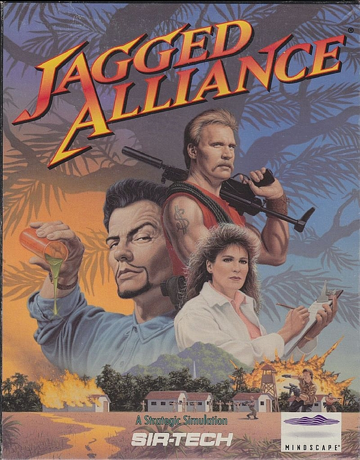
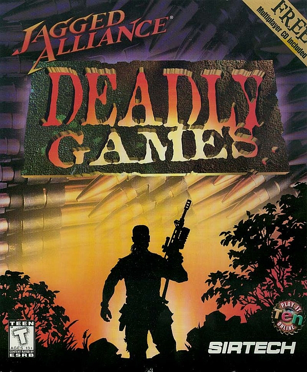

# History

Okay, so you've played the hell out of *Jagged Alliance 2* and it's add-on, *Unfinished Business*. You've at least heard of or seen some screenshots of *Jagged Alliance 1*. Finally, you took a glance at this new game called *Jagged Alliance: Flashback*, and thought "meh".

While this probably sums up the Jagged Alliance experience of many players, there are actually several more games to explore in the Jagged Alliance universe. None of them got the same level of attention as Jagged Alliance 2 and most of them were quickly forgotten after release.

Let's take a trip down memory lane and look at all the official and unofficial Jagged Alliance games and some of the major mods. How many will you recognize?

## Timeline of the Jagged Alliance series

### 1. Jagged Alliance (1994)

| AKA | Developer | Status |
| --- | --- | --- |
| Jagged Alliance 1, JA1 | Madlab Software | official game |

The first game in the series that started it all. *JA1* features gameplay similar to *JA2* with an extensive, sandbox-ish singleplayer campaign. Today, the first game in the series is by far less popular than it's successor and hasn't aged quite as well. However, it's still a very interesting game and the roots of what makes *JA2* so great can be found all over the place.
Speaking of age, these were the old days of PC-gaming, even before Windows 95. JA1 is a DOS game.

## 2. Jagged Alliance: Deadly Games (1995)

| AKA | Developer | Status |
| --- | --- | --- |
| Jagged Alliance 1.5, DG | Sirtech Canada | official sequel to JA1 |

Unlike *JA1*, *DG* is mission-based, offers a multiplayer mode and a map editor. It runs on the same engine as *JA1* and is often referred 
to as *Jagged Alliance 1.5*.
When it first came out, *DG* was widely viewed as just an add-on for *JA1* or a mission-pack. This was probably because it looked more or less the same and also shared most of it's content. Nevertheless, it's an original and very special game in the Jagged Alliance series and it's unique playstyle hasn't really been duplicated so far.
By the way, both *JA1* and *DG* were re-released on Steam as the Jagged Alliance: Gold Edition in 2014 by bitComposer Games.

## 3. Jagged Alliance 2 Demo (1998)

PICTURE

| AKA | Developer | Status |
| --- | --- | --- |
| JA2 Demo | Sirtech Canada | official demo of JA2 |

In late 1998, *JA2* was already in development for some years. It's release was delayed to 1999 and the demo was released both as a teaser and to calm down the impatiently waiting gamers.
Two different version of the demo were released: An English version and a German version. Besides the different language, the two versions also featured a different team of mercs.
The demo is a nice teaser and has some original content, not featured in the full version of the game. Although the explorable area in the demo is rather limited, it still offers a relatively high replay value, just like the full version of the game does.
The Demo is based on the Beta version of what would be the full release of *JA2*.

## 4. Jagged Alliance 2 (1999)

PICTURE

| AKA | Developer | Status |
| --- | --- | --- |
| JA2 | Sirtech Canada | official game |

*JA2* is still regarded as one of the best turn-based strategy titles ever made. No true sequel to the game that can even roughly reach it's high standards has been created as of today (2016). Most of the popularity and fame, the Jagged Alliance franchise enjoys up to this day, basically derives from this title.
Like with many good games, it's hard to describe what exactly makes *JA2* so great. It's probably the unique way it throws the best parts of several genres into a blender. Add a high level of immersion, high replay value and obvious dedication from the developer's side and you get... JA2!
JA2 was first released for Windows and later ported to Linux by Tribsoft in 2000.

## 5. Jagged Alliance 2: Unfinished Business (2001)

PICTURE

| AKA | Developer | Status |
| --- | --- | --- |
| Jagged Alliance 2.5, JA 2.5, UB | Sirtech Canada | official sequel to JA2 |

*UB* aka *JA 2.5* runs on the same engine as *JA2*, with some modifications. The gameplay is more or less the same as before, but large portions of *JA2's* features were cut out to offer a more action-orientated gameplay. This is especially true for almost the whole strategic part of the game.
This standalone add-on was heavily criticized for it's short campaign. And indeed, veterans of *JA2* are able to complete *UB's* campaign in a single session, lasting only a few hours. *UB* also suffers from a horrible localization. A fact, which becomes even more obvious because *JA2's* localization was excellent.
Two of *UB's* greatest features were the inclusion of the map editor and the possibility to import mercs from *JA2*.
Similar to *DG*, *UB* was widely regarded as just some sort of mission-pack to *JA2*.

## 6. Deidranna Lives! (2001)

PICTURE

| AKA | Developer | Status |
| --- | --- | --- |
| DL | JA2 Modsquad | fan-made mod for JA2 |

Although it's debatable if *DL* has aged as well as other mods like, for example *Urban Chaos*, *DL* is still a very special mod.
*DL* was the first major mod for *JA2*. It was extremely popular back in the old days and, because of it's sheer amount of content, it was also a milestone in JA2-modding.
Apart from its technical aspects, it was, and of course still is, also fun to play.

## 7. Jagged Alliance 2 v1.12 (Gold Pack) (2002)

PICTURE

| AKA | Developer | Status |
| --- | --- | --- |
| JA2 Gold, JA2 1.12 | Sirtech Canada | official re-release of JA2 |

In 2002 came the Gold Pack, which is a bundle of both *JA2* and *UB*. But the version of *JA2* from the Gold Pack is not identical with "normal" *JA2*. The *JA2 Gold* version is the definitive version of *JA2*, the holy grail of the Jagged Alliance franchise. What makes the gold version special? – It has more bugfixes compared to older versions. But (more importantly) also takes some features and modifications from *UB* and incorporates them into *JA2*.
Things can be a bit confusing here, because the Gold version can only be identified by it's version number. To make it absolutely clear:
+ Version of JA2 ≤1.06 are "normal" version
+ Version of JA2 ≥1.07 are gold versions.
+ **Normal JA2 can not be patched to the gold version!**
+ Jagged Alliance v1.12 is the last official release of JA2.

## 8. Vietnam: SOG'69 (2002)

PICTURE

| AKA | Developer | Status |
| --- | --- | --- |
| SOG'69, SOG | Jay aka Becoming X | fan-mad mod for UB |

The release of the map editor together with *UB* spawned hundreds of user-made maps and campaigns.
*SOG'69* is one of the most popular user-made campaigns (if no **the** most popular) for *UB* ever made.
It takes the player to the Vietnam war, which is a totally new setting for a Jagged Alliance game.
The amount of content and it's high level of immersion is second to none. This mod is an absolute must-play for everyone who owns *UB*.

## 9. Sirtech Canada Ltd. goes bankrupt (2003)

PICTURE

This fatal event can be regarded as a turning point in the history of Jagged Alliance.
Sirtech Canada Ltd. was the last division of Sir-Tech, Inc., which was the publisher and/or developer of the whole Jagged Alliance franchise so far. Concerning official sequels, thing really went downhill from here on.

## 10. Urban Chaos (2003)

PICTURE

| AKA | Developer | Status |
| --- | --- | --- |
| UC | JA2 Modsquad | fan-mad mod for JA2 |

*UC* is a true masterpiece and definitely one of the greatest mods for vanilla *JA2*. It's basically a full conversion mod that offers a whole new storyline and a whole new campaign.
*UC* is even more impressive when you consider the fact, that it was developed without any access to *JA2's* sourcecode, which was still about to be released.

## 11. Jagged Alliance 2: Wildfire (2004)

PICTURE

| AKA | Developer | Status |
| --- | --- | --- |
| WF | i-Deal games | fan-made mod for JA2, eventually turned into an official sequel |

What started as a free mod for *JA2* eventually became a commercial project. The final game isn't a true sequel to *JA2* and feels more like a remake. While the engine and the game's content was altered (e.g. maps, weapons, mercs), the story remains unchanged. 
Because of severe problems between the developer and the publisher, two different commercial versions of this are floating around: v5 and v6, which are completely different: v5 can't be upgraded to v6 and v6-specific patches can't be applied to v5.
As with *JA2 Gold*, things are a bit confusing here. Basically, there are three different version of WF:
+ old releases ≤4, which are free mods
+ version 5, which is a commercial release
+ version 6, which is a different commercial release
*WF* got mixed reviews at best. It's main issues are the unbalanced gameplay, the large number of bugs and the fact that it runs on the *JA2* engine. While the engine was modified, it was nevertheless absolutely outdated when *WF* came out.

## 12. JA2's sourcecode is released (2004)

PICTURE

The sourcecode is the basis for the *JA2 Stracciatella* project and many other great mods, including *v1.13*. It was released together 
with *WF*. The Source was released with a license that basically allows modders to create non-commercial projects with it.

## 13. Jagged Alliance 2 v1.13 (2005)

PICTURE

| AKA | Developer | Status |
| --- | --- | --- |
| JA2 v1.13, v1.13, 1.13 | JA2 community | fan-made mod for JA2 and modding platform |

The *v1.13 mod* is a massive mod that changes just about every aspect of the game and introduces tons of features. It is impossible to list even the most important features here, because there are so many of them.
Some of the features are:
tons of new items, a weather-system, a new AP-system, a new CtH-system, possibility to have much bigger maps, all the mercs from 
*JA1* included, and much more...
*v1.13* is also a platform for several other mods. Some major mods based on v1.13 include Arulco Folding Stock, AIMNAS and Arulco Revisited.

## 14. Brigade E5: New Jagged Union (2005)

PICTURE

| AKA | Developer | Status |
| --- | --- | --- |
| Brigade E5, E5 | Apeiron | unofficial sequel / "spiritual" successor |

This game started as a fan-project, titled Project E5. After several years of development, Russian publisher 1C bought the project and further development eventually lead us to the game we got.
*Brigade: E5* is the first game in a series of sequels, successors and spin-offs that all try to either be a remake of JA2 or a sequel to it. It's also the first "modern" (modern = after *JA2*) game in the Jagged Alliance universe.
*Brigade E5* features some good 3D graphics for its time. And that's about the most positive thing there is to say about this game. On the bad side, it's full of bugs and the gameplay is mediocre at best.

## 15. Jagged Alliance 2 Stracciatella (2006)

PICTURE

| AKA | Developer | Status |
| --- | --- | --- |
| JA2 Stracciatella | Tron | unofficial patch and modding platform for JA2 |

*JA2 Stracciatella* was started by Tron and run by him solo for a loooong time.

## 16. Hired Guns: The Jagged Edge (2007)

PICTURE

| AKA | Developer | Status |
| --- | --- | --- |
| Jazz: Hired Guns | GFI | unofficial sequel / "spiritual" successor |

Russian developer GFI was commissioned to develop two Jagged Alliance games by the IP holder of the Jagged Alliance franchise, Strategy First. These two games were supposed to be Jagged Alliance 3, a sequel to *JA2*, and Jagged Alliance 3D, a remake of *JA2*, just with better graphics.
To cut a long and strange story short: Things went horribly wrong. In the end, no official sequel or remake were developed by GFI and Strategy First withdrew the rights on the JA franchise from GFI. What we got in the end was *Jazz: Hired Guns*, later renamed to *Hired Guns: The Jagged Edge*. This game was originally developed to be Jagged Alliance 3D. But since GFI had no rights on the IP anymore, the game was renamed.
And how does it play? – The very first impression is "*JA2* with a new graphic engine". Sounds good so far. However, there is also a bad AI, frustrating gameplay and a bunch of bugs. Like many games on this list, *Hired Guns: The Jagged Edge* underwent a troubled development, which concluded in a strange and dubious release. It quickly drifted off into obscurity.
