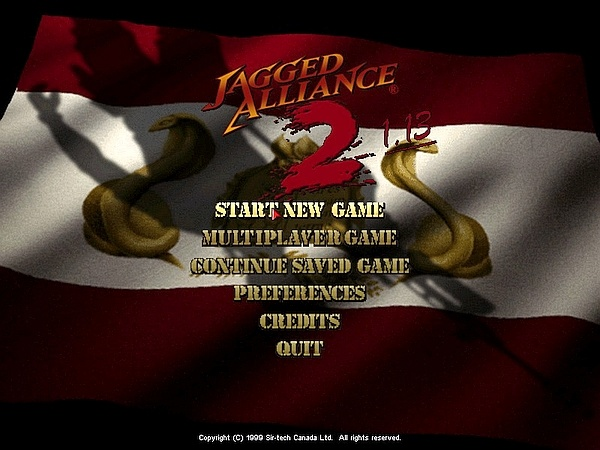
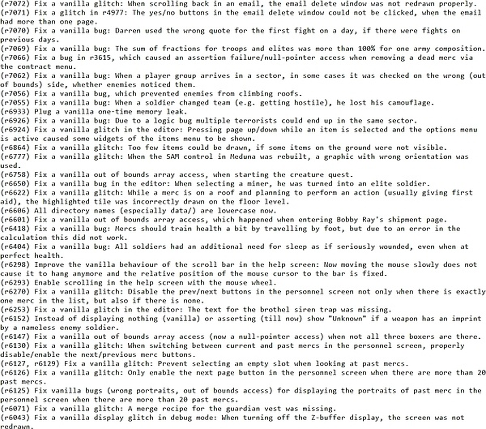
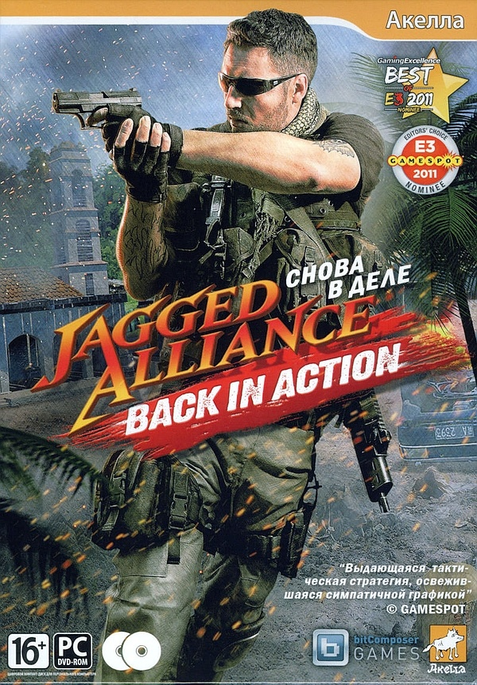
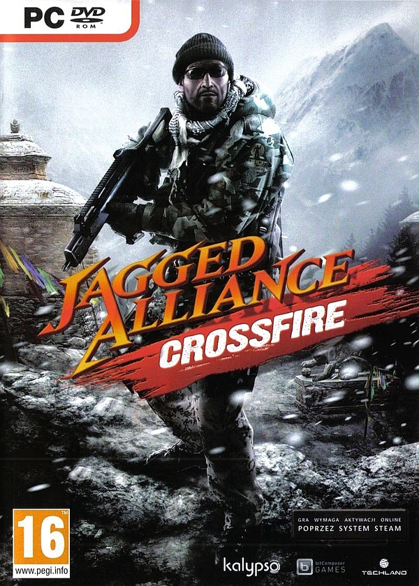

# History of Jagged Alliance 2

Back in 1999, Jagged Alliance 2, the sequel to Jagged Alliance, was released. It got lots of attention and was rewarded with countless "game of the year" awards. To this day, JA2 is still regarded as the king of turn-based strategy. Considering that JA2 is now almost 20 years old, makes you wonder... "Why didn't they make another sequel?" -" What happened to the franchise?"

Let's find out by taking a look at all the official and unofficial Jagged Alliance games and some of the major mods in chronological order. Welcome to the *timeline of the Jagged Alliance series*!

# Timeline of the Jagged Alliance series

  * [1. Jagged Alliance (1994)](#1-jagged-alliance-1994)
  * [2. Jagged Alliance: Deadly Games (1995)](#2-jagged-alliance-deadly-games-1995)
  * [3. Jagged Alliance 2 Demo (1998)](#3-jagged-alliance-2-demo-1998)
  * [4. Jagged Alliance 2 (1999 / 2000)](#4-jagged-alliance-2-1999--2000)
  * [5. Jagged Alliance 2: Unfinished Business (2001)](#5-jagged-alliance-2-unfinished-business-2001)
  * [6. Deidranna Lives! (2001)](#6-deidranna-lives-2001)
  * [7. Jagged Alliance 2 Gold Pack (2002)](#7-jagged-alliance-2-gold-pack-2002)
  * [8. Vietnam: SOG'69 (2002)](#8-vietnam-sog69-2002)
  * [9. Sirtech Canada Ltd. goes bankrupt (2003)](#9-sirtech-canada-ltd-goes-bankrupt-2003)
  * [10. Urban Chaos (2003)](#10-urban-chaos-2003)
  * [11. Jagged Alliance 2: Wildfire (2004)](#11-jagged-alliance-2-wildfire-2004)
  * [12. JA2's sourcecode is released (2004)](#12-ja2s-sourcecode-is-released-2004)
  * [13. Jagged Alliance 2 v1.13 mod (since 2005)](#13-jagged-alliance-2-v113-mod-since-2005)
  * [14. Brigade E5: New Jagged Union (2005)](#14-brigade-e5-new-jagged-union-2005)
  * [15. Jagged Alliance 2 Stracciatella (2006-2013)](#15-jagged-alliance-2-stracciatella-2006-2013)
  * [16. Hired Guns: The Jagged Edge (2007)](#16-hired-guns-the-jagged-edge-2007)
  * [17. 7.62: High Calibre (2007 / 2008)](#17-762-high-calibre-2007--2008)
  * [18. Jagged Alliance DS (2009)](#18-jagged-alliance-ds-2009)
  * [19. Jagged Alliance Online (2012-2015)](#19-jagged-alliance-online-2012-2015)
  * [20. Jagged Alliance: Back in Action (2012)](#20-jagged-alliance-back-in-action-2012)
  * [21. Jagged Alliance: Crossfire (2012)](#21-jagged-alliance-crossfire-2012)
  * [22. Jagged Alliance 2 Stracciatella continued (2013-2016)](#22-jagged-alliance-2-stracciatella-continued-2013-2016)
  * [23. Jagged Alliance: Flashback (2014)](#23-jagged-alliance-flashback-2014)
  * [24. Jagged Alliance Online: Reloaded (2015)](#24-jagged-alliance-online-reloaded-2015)
  * [25. Jagged Alliance 2 Stracciatella continued continued (since 2016)](#25-jagged-alliance-2-stracciatella-continued-continued-since-2016)
  * [26. Jagged Alliance 3](#26-jagged-alliance-3)
- [Add-on: Other games worth mentioning](#add-on-other-games-worth-mentioning)

## 1. Jagged Alliance (1994)

| AKA | Developer | Status |
| --- | --- | --- |
| Jagged Alliance 1, JA1 | Madlab Software | official game |

The first game in the series that started it all. JA1 features similar to JA2 with an extensive, sandbox-ish singleplayer campaign. Today, the first game in the series is by far less popular than it's successor and it hasn't aged quite as well. However, JA1 is still a very interesting game and the roots of what makes JA2 so great can be found all over the place. This includes many of the memorable characters and the high level of cheesiness.
Speaking of age, these were the old days of PC-gaming, even before Windows 95. JA1 is a DOS game.

## 2. Jagged Alliance: Deadly Games (1995)

| AKA | Developer | Status |
| --- | --- | --- |
| JA 1.5, DG | Sirtech Canada | official sequel to JA1 |

Unlike JA1, DG is mission-based, offers a multiplayer mode and a map editor. It runs on the same engine as JA1 and is often referred 
to as Jagged Alliance 1.5.
When it first came out, DG was widely viewed as just an add-on for JA1 or a mission-pack. This was probably because it looked more or less the same and also shared most of it's content. Nevertheless, it's an original and very special game in the Jagged Alliance series and its unique playstyle, with its multiplayer mode, hasn't really been duplicated so far.
By the way, both JA1 and DG were re-released on Steam as the [Jagged Alliance: Gold Edition](http://store.steampowered.com/app/283270/?) in 2015 by THQ Nordic GmbH Games.

## 3. Jagged Alliance 2 Demo (1998)

| AKA | Developer | Status |
| --- | --- | --- |
| JA2 Demo | Sirtech Canada | official demo of JA2 |

In late 1998, JA2 was already in development for some years. Its release was delayed to 1999 and the demo was quickly released both as a teaser and to calm down the impatiently waiting gamers.
Two different version of the demo were released: An English version and a German version. Besides the different language, the two versions also featured a different team of mercs.
The demo is a nice teaser and has some original content, not featured in the full version of the game. Although the explorable area in the demo is rather limited, it still offers a relatively high replay value, just like the full version of the game does.
The Demo is based on the Beta version of what would be the full release of JA2.
The JA2 Demo can be a bit hard to track down these days. You can download it [here](http://kermi.pp.fi/JA_2/Other_Stuff/Demo/).

## 4. Jagged Alliance 2 (1999 / 2000)

| AKA | Developer | Status |
| --- | --- | --- |
| JA2 | Sirtech Canada | official game |

JA2 is still regarded as one of the very best turn-based strategy  titles ever made. No true successor to the game that can even roughly reach it's high standards has been created as of today (2018). Most of the popularity and fame, the Jagged Alliance franchise enjoys up to this day, basically derives from this one title.
Like with many good games, it's hard to describe what exactly makes JA2 so great. It's probably the unique way it throws the best parts of several genres into a blender. This includes TBS, RPG, Simulation and more. Add a high level of immersion, high replay value and obvious passion and dedication from the developer's side and you get... JA2!
JA2 was first released for Windows and later ported to Linux by Tribsoft in 2000.

## 5. Jagged Alliance 2: Unfinished Business (2001)

| AKA | Developer | Status |
| --- | --- | --- |
| JA 2.5, UB | Sirtech Canada | official sequel to JA2 |

UB aka JA 2.5 runs on a slightly modified JA2 engine. The gameplay is more or less the same as before, but large portions of JA2's features were cut out to allow for a more streamlined and action-orientated gameplay. This is especially true for almost the whole strategic part of JA2.
After it's release, this standalone add-on was heavily criticized for it's short campaign and somewhat crippled gameplay. And indeed, veterans of JA2 are able to complete UB's campaign in a single session, lasting only a few hours. UB also suffers from a horrible localization. A fact, which becomes even more obvious since JA2's localization was excellent.
However, despite all criticism, UB introduced two great features: The inclusion of the map editor and the possibility to import mercs from JA2.
Similar to DG, UB was widely regarded as just some sort of mission-pack to its predecessor, leaving the fans hungry for more.

## 6. Deidranna Lives! (2001)

| AKA | Developer | Status |
| --- | --- | --- |
| DL | JA2 Modsquad | fan-made mod for JA2 |

Although it's debatable if DL has aged as well as other mods like, for example Urban Chaos, DL is still a very special mod.
DL was the first large-scale mod for JA2. It was extremely popular back in the old days and, because of it's sheer amount of content, it was also a milestone in JA2-modding.
Apart from its technical aspects, it was, and of course still is, also just fun to play.

## 7. Jagged Alliance 2 Gold Pack (2002)

| AKA | Developer | Status |
| --- | --- | --- |
| JA2 Gold, JA2 Gold Pak, JA2 1.12 | Sirtech Canada | official re-release of JA2 |

2002 brought JA2 fans the Gold Pack, which is a bundle of both JA2 and UB. But the version of JA2 from the Gold Pack is not identical with "normal" JA2. The JA2 Gold version is the definitive version of JA2, the holy grail of the Jagged Alliance franchise. What makes the gold version special? – It incorporates all regular patches and has even more bugfixes compared to older versions. But (more importantly) it lso takes some features and modifications from UB and incorporates them into JA2.
Things can be a bit confusing here, because the Gold version can only be identified by it's version number. To make it absolutely clear:
+ Version of JA2 ≤1.06 are "normal" version
+ Version of JA2 ≥1.07 are gold versions.
+ **Normal JA2 can not be patched to the gold version!**
+ Version 1.12 is the last official release of JA2 Gold.
Jagged Alliance 2 Gold is the ideal basis for JA2 Stracciatella!

## 8. Vietnam: SOG'69 (2002)

| AKA | Developer | Status |
| --- | --- | --- |
| SOG'69, SOG | Jay aka Becoming X | fan-mad mod for UB |

The release of the map editor together with UB spawned hundreds of user-made maps and campaigns.
SOG'69 is one of the most popular user-made campaigns (if no **the** most popular) for UB ever made.
It takes the player to the Vietnam war, which is a totally new setting for a Jagged Alliance game.
The amount of content and it's high level of immersion is second to none. This mod is an absolute must-play for everyone who owns UB.

## 9. Sirtech Canada Ltd. goes bankrupt (2003)

This fatal event can be regarded as a turning point in the history of Jagged Alliance.
Sirtech Canada Ltd. was the last division of Sir-Tech Inc., which was the publisher and/or developer of every Jagged Alliance game so far. Concerning official sequels, things really went downhill from here on.

## 10. Urban Chaos (2003)

| AKA | Developer | Status |
| --- | --- | --- |
| UC | JA2 Modsquad | fan-mad mod for JA2 |

UC is a true masterpiece and definitely one of the greatest mods for vanilla JA2 ever made. It's basically a full conversion mod that offers a whole new storyline and a new campaign in a brand-new setting.
UC is even more impressive when you consider the fact, that it was developed without any access to JA2's sourcecode, which was still about to be released.

## 11. Jagged Alliance 2: Wildfire (2004)

| AKA | Developer | Status |
| --- | --- | --- |
| WF | i-Deal games | fan-made mod for JA2 / official sequel to JA2 |

What started as a free mod for JA2 eventually became a commercial project. The final game isn't a true sequel to JA2 and feels more like a remake. While the engine and the game's content were altered (e.g. maps, weapons, mercs), the story remains unchanged. 
Because of severe problems between the developer and the publisher, two different commercial versions of this are floating around: v5 and v6, which are completely incompatible: v5 can't be upgraded to v6 and v6-specific patches can't be applied to v5.
As with JA2 Gol*, things are a bit confusing here. There are three different releases of WF:
+ old releases ≤ version 4, which are free mods
+ version 5, which is a commercial release
+ version 6, which is a different commercial release

WF got mixed reviews. It's main issues are the somewhat unbalanced gameplay, the rather large number of bugs and the fact that it runs on the JA2 engine. While the engine was modified to support higher resolutions, it was nevertheless absolutely outdated when WF came out.

## 12. JA2's sourcecode is released (2004)

The sourcecode is the basis for the JA2 Stracciatella project and many other great mods, including the v1.13 mod. It was released together 
with WF. The sourcecode was released with a license that basically allows modders to create non-commercial projects with it.

## 13. Jagged Alliance 2 v1.13 mod (since 2005)

| AKA | Developer | Status |
| --- | --- | --- |
| JA2 v1.13, v1.13, 1.13 | v1.13 community | fan-made mod for JA2 and modding platform |

The v1.13 mod is a massive mod that changes just about every aspect of the game and introduces tons of features. It is impossible to completely list even the most important features here, because there are so many of them.
Some of the features are:
tons of new items, a weather-system, a new AP-system, a new CtH-system, possibility to have much bigger maps, all the mercs from 
JA1 included, and much more...
v1.13 is also a platform for several other mods. Some major mods based on v1.13 include Arulco Folding Stock, AIMNAS and Arulco Revisited.
[The Bear's Pit Forum](http://thepit.ja-galaxy-forum.com/) is the main hangout for the JA2 v1.13 community.

## 14. Brigade E5: New Jagged Union (2005)

| AKA | Developer | Status |
| --- | --- | --- |
| Brigade E5, E5 | Apeiron | unofficial sequel / "spiritual" successor |

This game started as a fan-project, titled Project E5. After some years of development, Russian publisher 1C bought the project and further development eventually lead us to the game we got.
Brigade: E5 is the first game in a series of sequels, successors and spin-offs that all try to either be a remake of JA2 or a sequel to it, without calling themselves "JA3". It's also the first "modern" (modern = after JA2) game in the Jagged Alliance universe.
Brigade E5 features some good 3D graphics for its time. And that's about the most positive thing there is to say about this game. On the bad side, it's full of bugs and the gameplay is mediocre at best.

## 15. Jagged Alliance 2 Stracciatella (2006-2013)

| AKA | Developer | Status |
| --- | --- | --- |
| ja2s | Tron | unofficial patch and modding platform for JA2 |

JA2 Stracciatella was started by Tron and run by him solo for a loooong time. Besides the v1.13 mod, JA2 Stracciatella is the biggest mod with the longest and steadiest development time for JA2. Since it's very beginning, the goal of JA2 Stracciatella was to modernize and improve the game, without altering its gameplay.

## 16. Hired Guns: The Jagged Edge (2007)

| AKA | Developer | Status |
| --- | --- | --- |
| Jazz: Hired Guns | GFI | unofficial sequel / "spiritual" successor |

In the mid-2000s, Russian developer GFI was commissioned to develop two Jagged Alliance games by the IP holder of the Jagged Alliance franchise, Strategy First. These two games were supposed to be Jagged Alliance 3, a sequel to JA2, and Jagged Alliance 3D, a remake of JA2, just with better graphics.
To cut a long and strange story short: Things went horribly wrong. In the end, no official sequel or remake were developed by GFI and Strategy First withdrew the rights on the Jagged Alliance franchise from GFI. What we got in the end was Jazz: Hired Guns, later renamed to Hired Guns: The Jagged Edge. This game was originally developed to be Jagged Alliance 3D. But since GFI had no rights on the IP anymore, the game was renamed.
And how does it play? – The very first impression is "JA2 with a new graphic engine". Sounds good so far. However, it also features a bad AI, frustrating gameplay and a bunch of bugs. Like many games on this list, Hired Guns: The Jagged Edge underwent a troubled development, which concluded in a strange and dubious release. It quickly drifted off into obscurity.

## 17. 7.62: High Calibre (2007 / 2008)

| AKA | Developer | Status |
| --- | --- | --- |
| 7.62, Brigade 7.62: High Calibre | Apeiron | sequel to Brigade E5: New Jagged Union |

This is the direct sequel to Brigade E5. Although it was released in Russia in 2007, an international release didn't happen until late 2008. This game has a small but loyal fan base but didn't gain too much attention overall. An add-on named 7.62: Reloaded was released, but apparently only in Russia. This game lead to the development of a mod called Blue Sun Mod, which is a complete overhaul for this game. It is one of the few instances, where playing a modded game without having ever played the vanilla game is absolutely advised!
Overall, it's an okay-ish game. Maybe it would have been perceived more positively, if people didn't compare it to JA2 all the time.

## 18. Jagged Alliance DS (2009)

| AKA | Developer | Status |
| --- | --- | --- |
| JA1 DS | Cypron Studios, Strategy First | official re-release of JA1 |

This is mostly just a re-release of the original JA1. Some minor gameplay elements were changed. While this whole project was definitely a very nice idea, it also showed, how badly the first Jagged Alliance game has aged.
And by badly aged, I'm not referring to the graphics, but to the controls and interface, which are by far less userfriendly than in JA2.
Now, if they would have ported JA2, that would have been truly amazing!

## 19. Jagged Alliance Online (2012-2015)

| AKA | Developer | Status |
| --- | --- | --- |
| JAOnline, JAO | Cliffhanger Productions | official game |

An average free2play aka pay2win multiplayer online game with the Jagged Alliance name on it. A new low-point for the franchise.
This game is not available anymore. Jagged Alliance Online has been converted into Jagged Alliance Online: Reloaded in 2015. More about that game later...

## 20. Jagged Alliance: Back in Action (2012)

| AKA | Developer | Status |
| --- | --- | --- |
| BiA | Coreplay | official game, remake of JA2 |

A remake of JA2. While it's not really a bad game, the only new and innovative thing BiA brought to the Jagged Alliance franchise besides better graphics is: DLC's. And thinking about it... this is in fact a very bad thing.
Obligatory DLC-rant aside, this game and it's sequel are probably the best "modern" games with the Jagged Alliance name on them. Of course, this doesn't mean too much, since the competition with everything on this list after JA2 is rather weak.

## 21. Jagged Alliance: Crossfire (2012)

| AKA | Developer | Status |
| --- | --- | --- |
| --- | Coreplay | sequel to BiA |

The official sequel to BiA. Both Crossfire and BiA were released within 2012. Not to mention all the DLC's, which were also released in the same year. So, judging just from the raw numbers, do you really expect this to be an original, innovative, high quality game?
As with BiA, Crossfire isn't really a bad game, but compared to JA2, it's safe to call it pale and soulless.

## 22. Jagged Alliance 2 Stracciatella continued (2013-2016)

| AKA | Developer | Status |
| --- | --- | --- |
| ja2s | gennady | unofficial patch and modding platform for JA2 |

It had become a bit quiet around the Stracciatella project. Keeping a project alive for such a long time with a very limited number of contributors is no easy task. gennady continued the Stracciatella project and started JA2 Stracciatella continued on Bitbucket. He managed to breathe new life into the project and lots of progress was made.

## 23. Jagged Alliance: Flashback (2014)

| AKA | Developer | Status |
| --- | --- | --- |
| Flashback, JA:F | Full Control | official game |

Game developer Full Control bought the Jagged Alliance franchise in 2013 and started what is so far the latest attempt at making a worthy sequel to JA2. 
Interestingly, this game was partly crowdfunded on Kickstarter and backed with $368.614. It's the first game in the Jagged Alliance franchise to be crowdfunded. Unfortunately, this game could neither convince the fanbase, nor was it a critical or commercial success in general. Several features which were supposed to be added to the game post-release were not realized. Needless to mention that Full Control games went bankrupt shortly after the release... a common pattern when dealing with the Jagged Alliance franchise...
Once more, Jagged Alliance got a sequel of mediocre quality which looks, plays and feels like a watered-down version of JA2 with improved graphics. To put this game in one (sad) word: **FAIL!**

## 24. Jagged Alliance Online: Reloaded (2015)

| AKA | Developer | Status |
| --- | --- | --- |
| JAO:Reloaded, JAO:R | Cliffhanger Productions | official game |

This is basically the same game as JAO, but it changed from a free2play title to a classic buy2play game.
This is definitely a huge step forward, but this game is nevertheless not very good. It has some DLC's available, but that doesn't improve the situation. JAO and AO:R are probably the most obscure titles in this list.

## 25. Jagged Alliance 2 Stracciatella continued continued (since 2016)

| AKA | Developer | Status |
| --- | --- | --- |
| ja2s | JA2 Stracciatella team | unofficial patch and modding platform for JA2 |

The team behind JA2 Stracciatella has regrouped and the project has moved to GitHub. A lot is happening right now and lots of progress is being made. The new team managed to release several new versions, the latest being 0.16.0: Apart from several bugfixes, this version also has some great new features, including a new game mode, exclusive to JA2 Stracciatella. Let's see where the future will get JA2 and the Stracciatella project!

## 26. Jagged Alliance 3

Jagged Alliance 3, an official, direct sequel to JA2 is the game that just didn't happen (yet). There were some serious attempts, including one made by Sirtech Canada itself, before they went out of business, and the one by GFI, which later became Hired Guns: The Jagged Edge.
Not only is there no game out there that is called Jagged Alliance 3, but (more importantly) there is also no sequel so far that manages to satisfy the fans of the series and/or to be a general success.

# Add-on: Other games worth mentioning

There are several games out there which share some or in some cases even several gameplay-elements with JA2 without being unofficial sequels or "spiritual successors". Basically, almost any game that features tactical battles with small squads, preferably in turn-based mode and with a military theme, has some resemblance to JA2.
Here's a short and incomplete list of games similar to JA2:
+ [Fallout Tactics: BoS](http://www.mobygames.com/game/windows/fallout-tactics-brotherhood-of-steel)
+ [Marauder](http://www.mobygames.com/game/windows/marauder___)
+ [Sabre Team](http://www.mobygames.com/game/sabre-team)
+ [Shadow Company: Left for Dead](http://www.mobygames.com/game/windows/shadow-company-left-for-dead)
+ [Silent Storm series](http://www.mobygames.com/game-group/silent-storm-universe)
+ [Wages of War: The Business of Battle](http://www.mobygames.com/game/windows/wages-of-war-the-business-of-battle)
+ [Wasteland series](http://www.mobygames.com/game-group/wasteland-series)
+ [X-Com series](http://www.mobygames.com/game-group/x-com-series)
